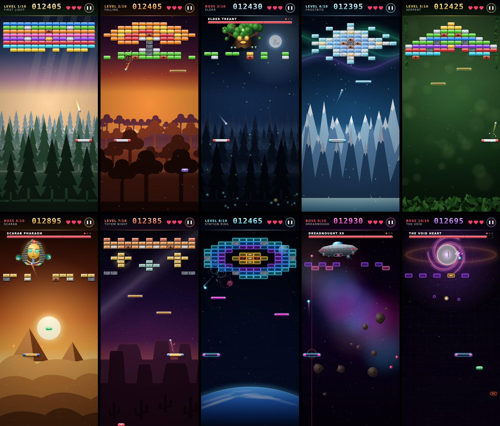
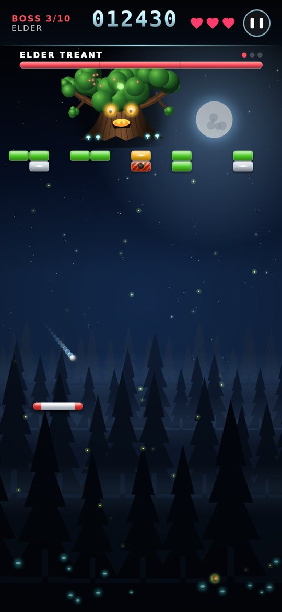
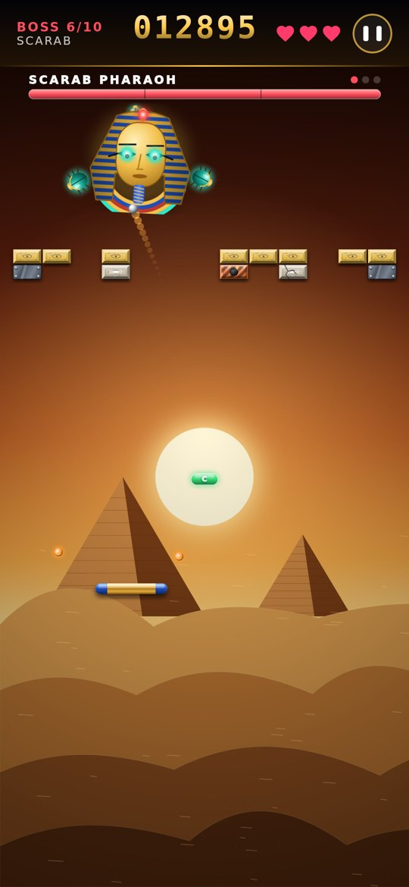
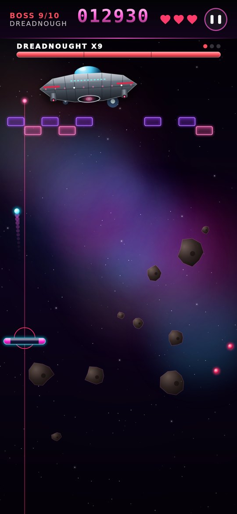
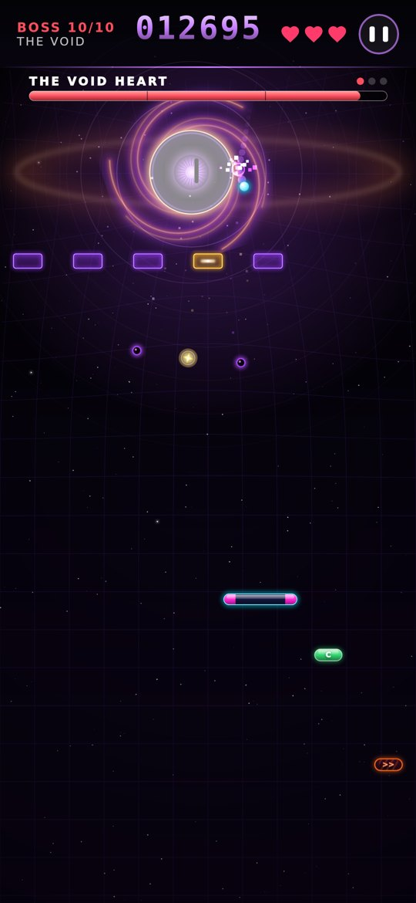
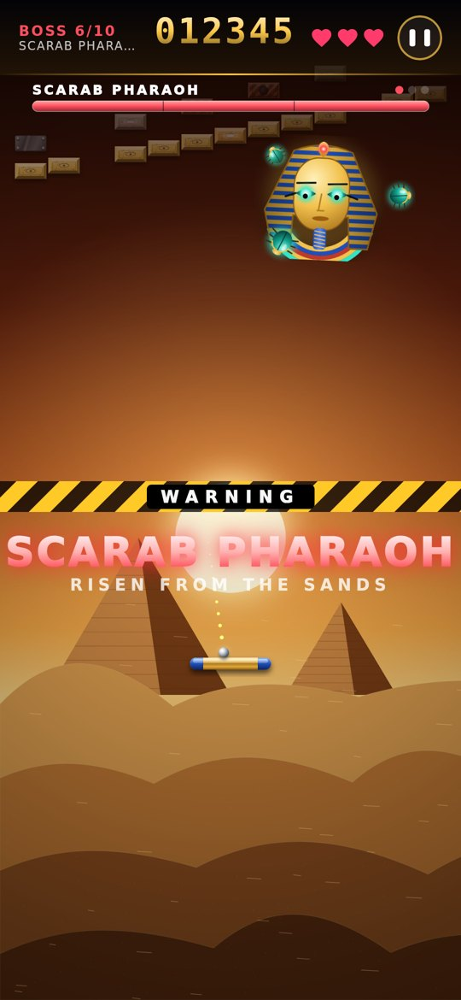
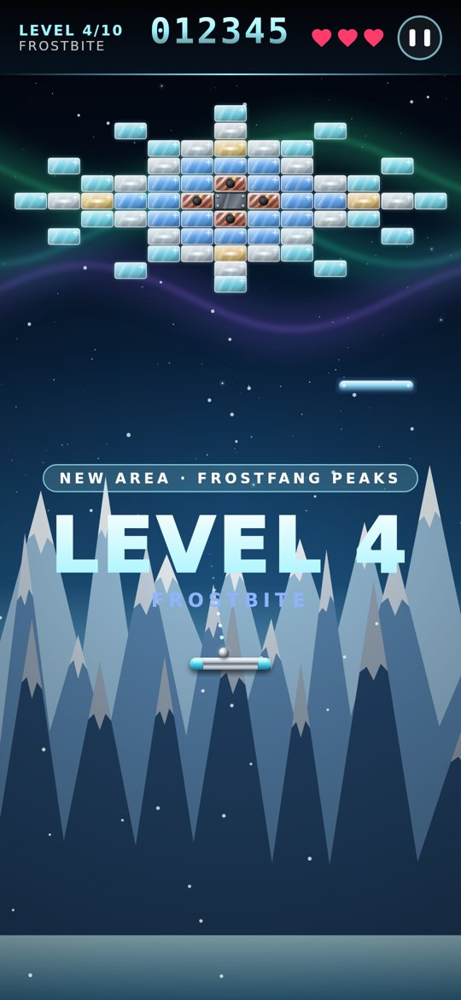
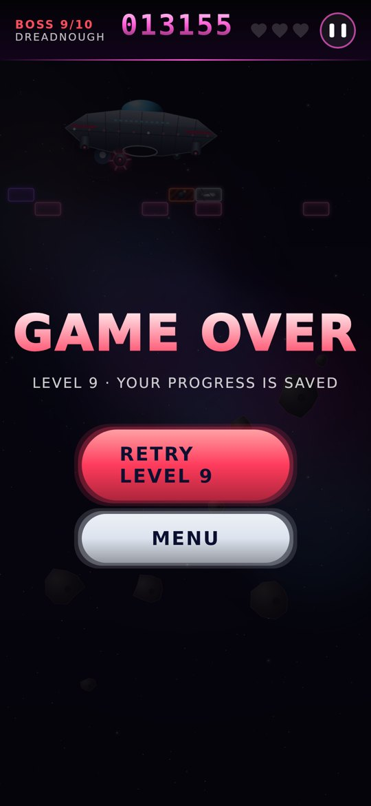

# Brick Breaker Retro

An arcade brick breaker for Android with **10 levels, 10 worlds and 4 boss fights**, built entirely in **Jetpack Compose**.

There are no images, sprite sheets, Lottie files or game engines in this repo. Every brick, ball, boss, planet and pine tree is painted in Kotlin on a `Canvas`.



**[Download the APK](https://github.com/zainkhalid91/brick-breaker-compose/releases/latest/download/BrickBreaker.apk)** (Android 8.0+)

---

## The game

| | Level | World | |
|---|---|---|---|
| 1 | First Light | Whispering Woods, at dawn | pollen drifting in the light |
| 2 | Falling Leaves | Amber Hollow, at sunset | autumn leaves falling |
| 3 | **Elder Treant** | Midnight Grove | **BOSS** |
| 4 | Frostbite | Frostfang Peaks | aurora and snowfall |
| 5 | Serpent Temple | Emerald Canopy | jungle |
| 6 | **Scarab Pharaoh** | Scorched Dunes | **BOSS** |
| 7 | Totem Night | Moonlit Mesa | shooting stars |
| 8 | Station Ring | Low Orbit | space |
| 9 | **Dreadnought X9** | Crimson Nebula | **BOSS** |
| 10 | **The Void Heart** | Event Horizon | **FINAL BOSS** |

The first three levels share one forest but move from dawn to dusk to midnight, so it feels familiar while the light keeps changing. After that every level is a new world, and the level banner says **NEW AREA** when you arrive.

Every level is harder than the one before it. The ball serves faster, curse capsules get more common, drones come more often, and later levels add walls that creep down and steel bars that sweep across.

### The bosses

<table>
<tr>
<td></td>
<td></td>
<td></td>
<td></td>
</tr>
</table>

Each boss has three stages, at 100%, 66% and 33% health. Every stage attacks faster and unlocks a new move. When a boss moves to its next stage the screen shakes and flashes **ENRAGED**, then **FINAL FORM**.

- **Elder Treant.** Shakes acorns from its crown, which stun your paddle. Its roots regrow bricks below it, and its wisps hunt you down. Its eyes follow the ball.
- **Scarab Pharaoh.** Three scarab shields orbit it on a tilted 3D path and block your shots. It fires fans of sand, and also golden ankhs. **Bat an ankh back with the paddle** and it hits the Pharaoh for triple damage.
- **Dreadnought X9.** Fires plasma volleys from its wing cannons and launches drones from its hangar. It also fires beam columns, but always marks them on screen first. Firing a beam opens its belly hatch, and **hits on an open hatch do double damage**.
- **The Void Heart.** A black hole whose **gravity bends your ball's path**. It fires rings of dark matter mixed with golden star shards you can send back, teleports, grows void crystals, and finishes with a spiral barrage.

Attacks are always telegraphed before they land. Eyes glow, mouths open, guide lines flicker and the void slits its pupil.

  

### You never lose your progress

- Losing your last life does not send you back to level 1. You **retry the level you were on**, with the score and lives you started it with.
- Progress saves at every level, when the app goes to the background, and when you go back to the menu. **CONTINUE** resumes the exact wall of bricks you left.
- **NEW GAME** asks first, because it resets all your progress.
- Each level awards up to 3 stars: one for clearing it, one for losing no lives, and one for beating the par time.

### Power ups and curses

| Bonus | | Curse (dark capsule, avoid it) | |
|---|---|---|---|
| W | Wide paddle | >< | Shrink |
| M | Multi ball (splits every ball in three) | >> | Rush (balls speed up) |
| S | Slow motion | <> | Reversed controls |
| L | Laser cannons | | |
| F | Fireball (melts through bricks, double boss damage) | | |
| C | Magnet catch | | |
| B | Barrier (saves one ball) | | |
| +1 | Extra life | | |
| x2 | Double score | | |
| X | Blast ball (next 3 hits explode) | | |

**Controls:** drag anywhere to move the paddle, and lift your finger to launch. Your finger never covers the paddle.

---

## How it is built

```
app/src/main/java/com/zainkhalid/brickbreaker/
├── engine/     pure simulation, no UI
│   ├── BrickEngine.kt    balls, bricks, capsules, lasers, drones, particles, save/retry
│   ├── BrickBoss.kt      the four bosses: movement, stages, attack patterns
│   ├── BrickLevels.kt    10 levels, 10 themes, 4 brick styles
│   └── PowerUp.kt
├── render/     draw-phase only
│   ├── BrickSprites.kt   bakes bricks, balls, paddles and the 10 backdrops
│   ├── BossSprites.kt    bakes the bosses and their projectiles
│   ├── BrickRenderer.kt  draws one frame: world, bosses, beams, weather
│   └── BrickPalette.kt
├── ui/         HUD, menu, banners, boss health bar, dialogs
└── data/       save point, best score, stars
```

Some details worth stealing:

- **Zero allocations per frame.** Every entity, from bricks and balls to boss shots and up to 800 particles, lives in preallocated primitive arrays. The garbage collector never runs mid game.
- **No recomposition at 120 Hz.** One `withFrameNanos` loop advances the engine and bumps a tick that only the `drawBehind` lambda reads. Each frame redraws one layer, with no recomposition and no layout pass. Compose state is used only for things that change rarely: score, lives, phase and boss health.
- **Exact sub-stepping.** Each frame is split so nothing moves more than 4 world units per step. A fast ball can never tunnel through a brick, and the ball's position always matches the real frame time.
- **Baked sprites.** Gradients, bevels and real Gaussian glows (`BlurMaskFilter`) are rendered once, off the main thread, into bitmaps. After that each sprite costs a single `drawImage`. Sprites are baked once per brick style and shared across themes. Each world's backdrop is baked only when it is needed: the next one is prepared during the stage-clear fanfare, then the two crossfade.
- **Boss feedback without per-frame objects.** Hit flashes and the enraged red pulse reuse the boss body through two `ColorFilter.tint`s that are created once.
- **Weather from time alone.** Snow, leaves, fireflies and void dust are computed from `time` and fixed seeds, so there is no particle state to store.
- **Gravity well.** The Void Heart bends the ball by turning its heading on every sub-step (`Δθ = a·h² / step`), so the ball's speed stays constant while its path curves.

## Build and run

1. Clone the repo and open it in **Android Studio** (a current stable or newer release).
2. Let Gradle sync, then press **Run** on a device or emulator (Android 8.0+).

From the command line:

```bash
./gradlew installRelease      # or assembleRelease, output in app/build/outputs/apk/release/
```

Every push to `main` builds the APK in GitHub Actions. To publish a release, run the **Android** workflow by hand and give it a tag such as `v2.0.0`. It attaches `BrickBreaker.apk` to that release.

## License

Apache License 2.0. Copyright 2026 Zain Khalid.
